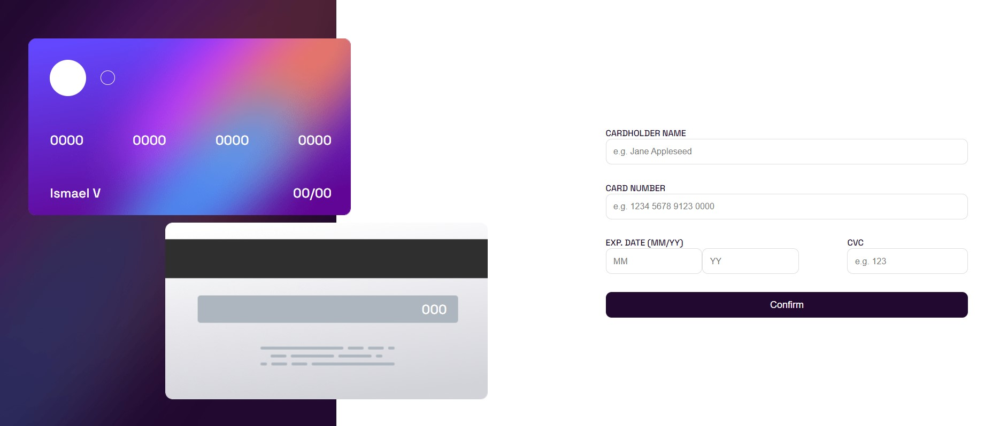

# Frontend Mentor - Interactive card details form solution

This is a solution to the [Interactive card details form challenge on Frontend Mentor](https://www.frontendmentor.io/challenges/interactive-card-details-form-XpS8cKZDWw). Frontend Mentor challenges help you improve your coding skills by building realistic projects. 

## Table of contents

- [Overview](#overview)
  - [The challenge](#the-challenge)
  - [Screenshot](#screenshot)
  - [Links](#links)
- [My process](#my-process)
  - [Built with](#built-with)
- [Author](#author)

## Overview

In this project, an interactive card was generated to fill in the data, validating that they are valid and displayed in real time.

### The challenge

Users should be able to:

- Fill in the form and see the card details update in real-time
- Receive error messages when the form is submitted if:
  - Any input field is empty
  - The card number, expiry date, or CVC fields are in the wrong format
- View the optimal layout depending on their device's screen size
- See hover, active, and focus states for interactive elements on the page

### Screenshot

### Links

- Solution URL: [https://github.com/ivargasm/interactive_card](https://github.com/ivargasm/interactive_card)
- Live Site URL: [Add live site URL here](https://your-live-site-url.com)

## My process

1: First design the layout with Html and Css
2: create a project with react and migrate the layout and add the interactive part with JS

### Built with

- Semantic HTML5 markup
- CSS custom properties
- Flexbox
- CSS Grid
- Mobile-first workflow
- [React](https://reactjs.org/) - JS library

## Author

- Website - [Ismael Vargas Martinez](https://ivargasm.com)
- Frontend Mentor - [@ivargasm](https://www.frontendmentor.io/profile/ivargasm)
